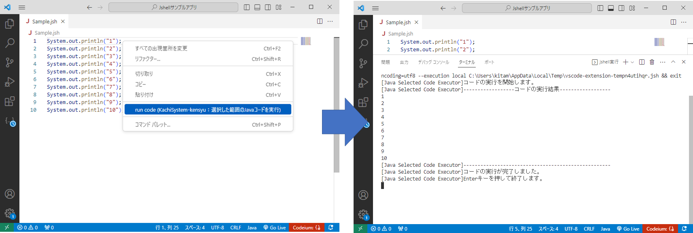
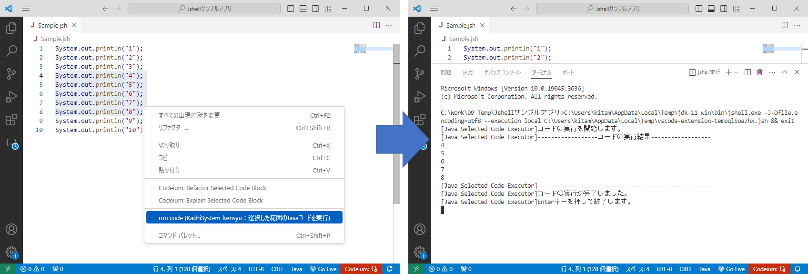

# Java Selected Code Executor

Java 9で提供されるJshellを利用して選択した範囲の不完全なJavaコードを実行する事ができます。

## ■設定

本拡張機能は内部的に保持しているJavaで動作します。

内部的に保持しているJavaには最低限のモジュールしか含まれていません。

* 内部的に保持しているJavaの情報

	* Javaの種類：OpenJDK

	* バージョン：11

	* 含まれるモジュール：java.base、jdk.jshell

JavaSEから提供されるAPIを十分に使用したい場合は動作に利用するJavaの変更をおこなってください。

変更を行う場合はVScodeの設定画面を開いて下記の通り設定を行ってください。

* 設定箇所：拡張機能 >> KachiSystem-kensyu.JavaSelectedCodeExecutor >> Java_home

* 設定値：＜Javaのインストールディレクトリ＞

設定ファイル（settings.json）を直接編集する場合は下記の内容を追加してください。

* JavaSelectedCodeExecutor.java_home: "＜Javaのインストールディレクトリ＞"

## ■使い方

* Java言語のファイルを開いて実行

* 実行したい箇所を選択して実行

## ■利用出来るメソッド

拡張機能で下記のメソッドが提供されています。

Javaコードの実行時に下記のメソッドが利用できます。

* void print(Object param)

	引数のObjectを出力して、行を終了します。
	
	System.out.println()と同様のメソッドです。

* void println(Object param) 

	引数のObjectを出力します。
	
	System.out.print()と同様のメソッドです。
	
* String input() 

	Scannerクラスのオブジェクトを作成しnextLine()を呼び出して入力された内容を取得します。
	
	取得した値はString型で返却されます。

* char inputToChar()

	Scannerクラスのオブジェクトを作成しnextLine()を呼び出して入力された内容を取得します。
	
	取得した値はchar型で返却されます。
	
	String.charAt(0)で入力内容の１文字目が返却されます。
	
* int inputToInt()

	Scannerクラスのオブジェクトを作成しnextLine()を呼び出して入力された内容を取得します。
	
	取得した値はint型で返却されます。
	
	入力内容がInteger.parseInt()で変換出来ない場合はエラーとなります。
	
* double inputToDouble()

	Scannerクラスのオブジェクトを作成しnextLine()を呼び出して入力された内容を取得します。
	
	取得した値はdouble型で返却されます。
	
	入力内容がDouble.parseDouble()で変換出来ない場合はエラーとなります。
	
* long inputToLong() 

	Scannerクラスのオブジェクトを作成しnextLine()を呼び出して入力された内容を取得します。
	
	取得した値はlong型で返却されます。
	
	入力内容がLong.parseLong()で変換出来ない場合はエラーとなります。
	
* float inputToFloat()

	Scannerクラスのオブジェクトを作成しnextLine()を呼び出して入力された内容を取得します。
	
	取得した値はfloat型で返却されます。
	
	入力内容がFloat.parseFloat()で変換出来ない場合はエラーとなります。
	
* short inputToShort() 

	Scannerクラスのオブジェクトを作成しnextLine()を呼び出して入力された内容を取得します。
	
	取得した値はshort型で返却されます。
	
	入力内容がShort.parseShort()で変換出来ない場合はエラーとなります。
	